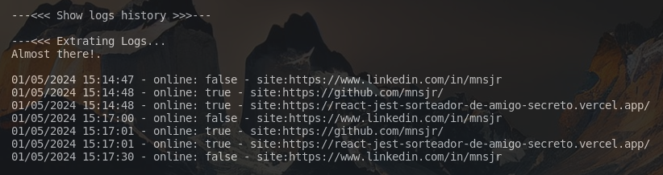

# GoLang-Monitor-WebApps
This app is a monitor for web applications.

It's a simple app written in Go Lang, executed via the terminal. It has the following functionalities:

- Monitor web apps
- Log registration
- Delete old logs

Running the script
```less
go run main.go
```


## Options
### 1- Delete old logs
With a simple change in the code, you can modify the period before the current day from which you want to clean the logs whenever the code is executed.

On line 205 in main.go.
You can modify the range of logs to be deleted before a certain number of days: 
```less
    // Get the current date and subtract 2 days
	now := time.Now()
	period := now.AddDate(0, 0, -2)
```

Ou anteriores a uma quantidade de meses:
```less
	// Subtract 2 months from the current date to get the deadline
	now := time.Now()
	period = now.AddDate(0, -2, 0)
```

### 2- Monitoring
To monitor web applications, simply add the application addresses to the "sites.txt" file.
```less
https://github.com/mnsjr/
https://google.com/
```
Upon selecting option 2


You will be prompted for the number of times the program should monitor the URLs listed in sites.txt.

Next, another input will be requested for the delay between each monitoring.

Then the program starts monitoring, displaying and saving each log, which indicates whether the URL is on or off.


### 3- Show logs history
To display the logs history, simply select option 3.
The log history includes date, time, status, and URL, as shown in the following image.



### 0- Program exit
This option exits the program.


